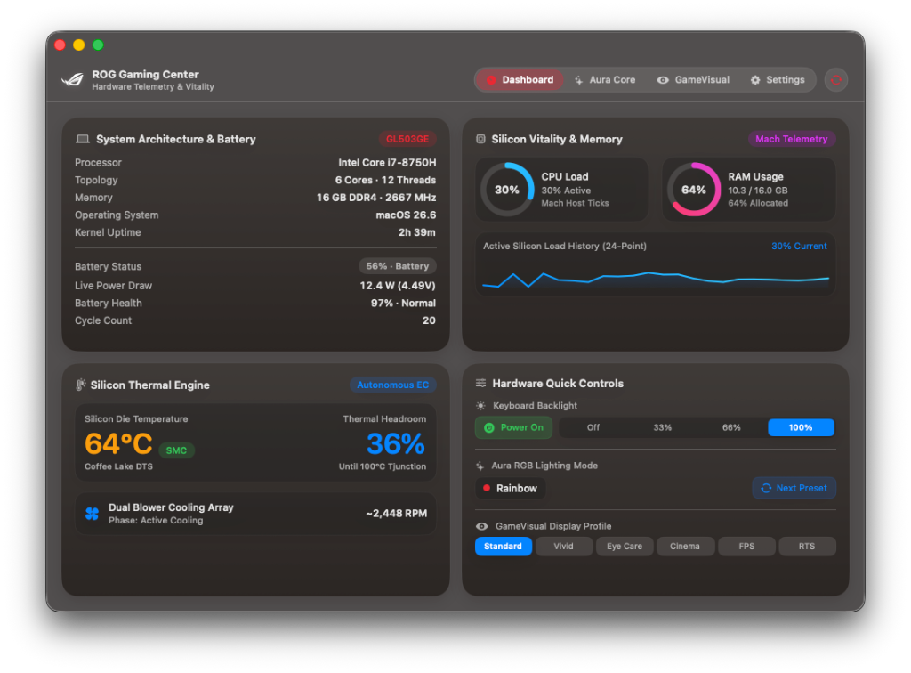

# ROG Gaming Center for macOS & Hackintosh

<p align="center">
  
</p>

<p align="center">
  <b>Native Swift Control Suite for ASUS ROG & TUF Laptops on macOS</b><br/>
  <i>Keyboard RGB Lighting, Real-Time Hardware Telemetry, GameVisual Display Calibration, Physical Fn Hotkeys, and CLI Automation.</i>
</p>

<p align="center">
  
  
  
  
  
  
</p>

<p align="center">
  
</p>

> [!IMPORTANT]
> **Active Development Notice:**
> This project is currently in active beta development. It is designed and tested for macOS installations on ASUS ROG and TUF laptops (including Hackintosh systems). If you test this on your hardware or encounter any issues, please [open an issue on GitHub](https://github.com/sritulasiram/rog-gaming-center-hackintosh/issues) with your laptop model, controller PID/VID, and diagnostic logs.

---

## Table of Contents

- [Overview](#overview)
- [System Architecture](#system-architecture)
- [Interface & Navigation](#interface--navigation)
- [Key Features](#key-features)
  - [1. Dashboard & Hardware Telemetry](#1-dashboard--hardware-telemetry)
  - [2. Aura Core Lighting Studio](#2-aura-core-lighting-studio)
  - [3. ROG GameVisual Display Calibration](#3-rog-gamevisual-display-calibration)
  - [4. Physical Fn Keyboard Hotkeys](#4-physical-fn-keyboard-hotkeys)
  - [5. Dedicated Hardware ROG Key Launcher](#5-dedicated-hardware-rog-key-launcher)
  - [6. Battery Health Charging Threshold](#6-battery-health-charging-threshold)
  - [7. Menu Bar Companion Popover](#7-menu-bar-companion-popover)
  - [8. Sleep / Wake Auto-Repair Watchdog](#8-sleep--wake-auto-repair-watchdog)
  - [9. Standalone CLI Utility (`rogauracore`)](#9-standalone-cli-utility-rogauracore)
- [Supported Hardware & Compatibility](#supported-hardware--compatibility)
- [Installation & Quick Start](#installation--quick-start)
- [macOS Permissions (Input Monitoring)](#macos-permissions-input-monitoring)
- [CLI Reference Guide (`rogauracore`)](#cli-reference-guide-rogauracore)
- [Hackintosh Setup & OpenCore Notes](#hackintosh-setup--opencore-notes)
- [Codebase Structure](#codebase-structure)
- [Automated Backend Test Suite](#automated-backend-test-suite)
- [Acknowledgements](#acknowledgements)
- [Disclaimer](#disclaimer)
- [License](#license)

---

## Overview

**ROG Gaming Center for macOS** is a lightweight, native Swift application designed to provide essential hardware controls for ASUS ROG and TUF laptops running macOS, particularly Hackintosh configurations.

Official ASUS software (*Armoury Crate* / *ROG Gaming Center*) is Windows-only. This utility brings core functionality to macOS through native system frameworks without background bloat or external runtimes:

- **Zero External Runtimes:** Written entirely in Swift and SwiftUI. No Python, Node.js, Electron, libusb, or bridging headers.
- **Direct IOKit HID Driver:** Communicates directly with onboard ASUS USB HID microcontrollers (`VID: 0x0B05`, `PID: 0x1869`) using Apple's `IOHIDManager`.
- **Hardware-Safe Serialization:** Employs a 10ms FIFO queue for USB feature reports to ensure reliable register latching on ITE controllers.
- **Direct Kernel Telemetry:** Reads live metrics directly from system frameworks (`AppleSMC` kernel registers for CPU die temperature `TC0P`, Mach host statistics for CPU load, Mach VM for memory, and `AppleSmartBattery` via IOKit).
- **CoreGraphics Gamma Calibration:** Applies GameVisual display profiles directly to hardware gamma lookup tables via `CGSetDisplayTransferByTable`.
- **Physical Hotkey Handling:** Captures physical Fn hotkeys and the dedicated ROG key through an integrated EventTap and HID monitor.

---

## System Architecture

```
+---------------------------------------------------------------------------------------------------+
|  [● ● ●]   (ROG) GAMING CENTER       [ Dashboard | Aura Core | GameVisual | Settings ]       ( ↻ )|
+---------------------------------------------------------------------------------------------------+
|                                       PAGE CONTENT AREA                                           |
|                                                                                                   |
|  [DASHBOARD / 3-COLUMN VIEW]                                                                      |
|  - System Specs & Live Battery Telemetry (Watts, Volts, Cycles, Health %)                         |
|  - AppleSMC CPU Die Temp (TC0P), Thermal Headroom, Fan Status, and Rolling CPU Sparkline          |
|  - Dual Gauges (Mach CPU Load % & Memory Allocation)                                              |
|  - Hardware Quick Controls (Backlight Power, 4-Step Brightness, Aura Preset, GameVisual Profile)  |
+---------------------------------------------------------------------------------------------------+
```

### Data Flow & Communication Stack

```
+-----------------------------------------------------------------------+
|  UI Layer: SwiftUI Views (Dashboard, AuraStudio, GameVisual, Popover) |
+-----------------------------------------------------------------------+
                                  │
                                  ▼
+-----------------------------------------------------------------------+
|  Service Layer: AuraService, TelemetryService, DisplayCalibration     |
|  - Lighting State, Watchdog, Global Hotkey EventTap                   |
|  - CoreGraphics Gamma LUT Profiles, AppleSmartBattery Polling         |
+-----------------------------------------------------------------------+
                                  │
                                  ▼
+-----------------------------------------------------------------------+
|  Driver Layer: AuraDriver & SMCReader (IOKit HID & AppleSMC)          |
|  - Device Matching (VID 0x0B05, PID 0x1869, Usage Page 0xFF89)        |
|  - FIFO Serial Queue with 10ms Latch Delays                           |
|  - Direct AppleSMC TC0P Kernel Register Access                        |
+-----------------------------------------------------------------------+
                                  │
                                  ▼
+-----------------------------------------------------------------------+
|  Hardware Layer: ITE 8910 USB Controller & Motherboard EC             |
|  - 17-Byte Feature Reports: Handshake -> Brightness -> Set -> Latch   |
|  - CoreGraphics Display Hardware LUT Transfer Tables                  |
+-----------------------------------------------------------------------+
```

---

## Interface & Navigation

The application uses a unified macOS titlebar and toolbar designed around native desktop ergonomics:

- **Unified Top Header Toolbar:**
  - Standard macOS window controls (traffic lights) seamlessly integrated with the ROG brand cluster (vector ROG eye emblem and title).
  - Transparent drag area allows moving the window directly by dragging empty header space.
  - Separated from content by a crisp hairline border.
- **Translucent Segmented Capsule Navigation:**
  - Completely rounded capsule control with no vertical divider lines.
  - Content-based accent colors reflecting each view's theme:
    - **Dashboard:** ROG Crimson Red
    - **Aura Core:** Chromatic Purple
    - **GameVisual:** Electric Cyan
    - **Settings:** Amber
- **Contextual Circular Action Button:**
  - 28×28pt circular button dead-centered on both axes, dynamically tinted to match the active tab's accent color:
    - **Dashboard:** Triggers an immediate hardware telemetry refresh.
    - **Aura Core:** Toggles keyboard backlight power on/off.
    - **GameVisual:** Resets display gamma lookup tables to factory standard.
    - **Settings:** Opens the project repository in your default browser.

---

## Key Features

### 1. Dashboard & Hardware Telemetry
- **System Specifications & Battery Telemetry:**
  - Processor model, core/thread topology, RAM capacity, model identifier, and system uptime.
  - Live battery metrics from `AppleSmartBattery`: power draw in Watts ($V \times A$), voltage, health percentage, cycle count, and charging status.
- **CPU Thermals & Cooling Status:**
  - Direct CPU silicon die temperature readout from AppleSMC (`TC0P`).
  - Thermal headroom indicator calculating distance to the junction limit.
  - Cooling status threshold indicator and dual blower fan RPM reporting with hardware authenticity disclosure (`SMC` for direct AppleSMC registers, `EST` for estimated thermal modeling).
  - 24-point rolling CPU load sparkline updated via Mach host kernel statistics.
- **Activity Gauges:**
  - Circular dials showing total CPU load percentage and active memory allocation.
- **Quick Controls Dock:**
  - Direct toggles for backlight power, 4-step brightness (`Off`, `33%`, `66%`, `100%`), lighting preset cycling, and GameVisual profile switching.

### 2. Aura Core Lighting Studio
- **Accurate Laptop Keyboard Layout:**
  - Full keyboard deck modeled after the physical ASUS layout, including proportional modifier keys, numeric keypad, isolated arrow keys, and styled WASD keycaps.
- **Hardware Lighting Modes:**
  - **Static:** Single solid color or curated multi-zone themes (Republic ROG, Cyberpunk, Sunset, Aurora, Fire & Ice, Synthwave).
  - **Breathing:** Single-color, dual-color cross-fade, or multi-color cycling.
  - **Color Cycle:** Continuous spectrum rotation.
  - **Rainbow:** Hardware Mode `0x03` autonomous wave.
  - **Strobing:** Single-color or multi-color strobe effect.
- **Custom Theme Management:**
  - Save any custom 4-zone lighting configuration as a named reusable theme.
  - Dynamic theme pills display 4-zone color previews, active selection indicators, and instant deletion controls.
- **Color Selection:**
  - Quick-pick color swatches, direct 6-character hex input, and integration with the native macOS `NSColorPanel`.
- **Efficient Updates:**
  - Event-driven UI updates to ensure low idle CPU usage.

### 3. ROG GameVisual Display Calibration
- **Direct CoreGraphics Gamma Table Modification:**
  - Applies calibrated gamma curves to the active display using `CGSetDisplayTransferByTable`, running directly through WindowServer without background daemons.
- **6 Display Profiles:**
  - **Default:** Neutral sRGB baseline.
  - **Vivid Gaming:** Enhanced contrast and midtone saturation.
  - **Eye Care:** Reduced blue spectrum output (~22% reduction) for low-light comfort.
  - **Cinema:** Adjusted gamma curve for deeper shadow detail in media.
  - **FPS Mode:** Lifted dark levels to improve visibility in shadows.
  - **RTS / RPG:** Sharpened mid-range colors for game terrain.
- **Automatic Exit Restoration:**
  - Display gamma tables are safely reverted to the native macOS baseline upon application quit (via Cmd+Q, menu bar quit, or window close) or system sleep, preventing persistent color shifts.
- **Interactive Preview & Reset:**
  - Includes a visual simulation stage with an instant A/B baseline comparison and a one-click reset to factory defaults.

### 4. Physical Fn Keyboard Hotkeys
The app captures physical keyboard hotkeys matching the ASUS printed legends through an active EventTap:

| Hotkey | Legend | Action |
| :--- | :--- | :--- |
| **`Fn + Up Arrow`** / **`Fn + F8`** | Backlight Up | Increases keyboard brightness (Off → 33% → 66% → 100%) |
| **`Fn + Down Arrow`** / **`Fn + F7`** | Backlight Down | Decreases keyboard brightness (100% → 66% → 33% → Off) |
| **`Fn + Right Arrow`** | Aura Next | Cycles forward through lighting modes |
| **`Fn + Left Arrow`** | Aura Prev | Cycles backward through lighting modes |
| **`Fn + Space`** | Backlight Power | Toggles keyboard backlight on/off |
| **`Fn + F1`** | Audio Mute | Toggles macOS audio mute |
| **`Fn + F2` / `Fn + F3`** | Volume Down / Up | Adjusts macOS system volume |
| **`Fn + F4` / `Fn + F5`** | Display Brightness | Adjusts screen brightness |
| **`Fn + F6`** | Touchpad Toggle | Handled via hardware ACPI / VoodooI2C |
| **`Fn + F9`** | Screen Lock | Locks the macOS screen |
| **`Fn + F11`** | System Sleep | Puts macOS to sleep |
| **Physical ROG Key** | ROG Logo | Toggles the ROG Gaming Center window |

### 5. Dedicated Hardware ROG Key Launcher
- Intercepts input report `0x5A` payload `0x38` (`UsagePage: 0xFF31`, `Usage: 0x0038`) emitted by the physical ROG key via `IOHIDManager`.
- Runs directly without third-party key mappers (such as Karabiner-Elements) or custom ACPI DSDT overrides.
- Configurable action (default: toggle main window) with a 250ms hardware debounce to prevent double actuation.

### 6. Battery Health Charging Threshold
- Integrates with `AsusSMC.kext` to control laptop battery charging thresholds via `sysctlbyname("hw.asus.battery.charging_threshold")`.
- Configurable directly from **Settings** with 3 operational targets:
  - **60% (Maximum Lifespan):** Ideal for desk-bound systems continuously plugged into AC adapters.
  - **80% (Balanced):** Balances battery preservation with portable runtime.
  - **100% (Full Charge):** Maximum runtime for on-the-go travel.
- Threshold selection persists across reboots in `UserDefaults` and re-applies automatically on application launch.

### 7. Menu Bar Companion Popover
- Compact status item in the macOS menu bar for quick access.
- Left-click opens a popover with live vitals, backlight power toggle, brightness slider, lighting presets, and GameVisual profiles.
- Right-click reveals a fast context menu for quick adjustments or quitting the application.

### 8. Sleep / Wake Auto-Repair Watchdog
- **Background:** ASUS ITE USB controllers reset their volatile memory across system sleep transitions, often waking in an unlit state.
- **Solution:** A background observer listens for `NSWorkspace.didWakeNotification` and `screensDidWakeNotification`. Following a 600ms settling delay, it re-establishes the controller handshake and re-applies the user's active lighting profile automatically.

### 9. Standalone CLI Utility (`rogauracore`)
- A standalone, statically compiled CLI binary built alongside the main app.
- Allows headless scripting, cron automation, Raycast/Alfred extensions, or shell shortcuts without keeping the main UI open.

---

## Supported Hardware & Compatibility

### Primary Testbed
- **Model:** ASUS ROG Strix GL503GE
- **Controller:** ITE 8910 USB HID Controller (`VID: 0x0B05`, `PID: 0x1869`)
- **Status:** Fully tested and verified across all features (lighting, telemetry, hotkeys, watchdog).

### Compatible Models (ITE USB HID Protocol)
Laptops utilizing the ASUS ITE USB microcontroller protocol (`0x5A` handshake, `0x5D 0xB3` packet format, `0x5D 0xB5` set, `0x5D 0xB4` apply) are compatible with this driver architecture:

| Series | Models | Protocol / Status |
| :--- | :--- | :--- |
| **ROG Strix (15" & 17")** | GL503GE | **Verified Primary Testbed** |
| **ROG Strix (15" & 17")** | GL503VD, GL503VS, GL503VM, GL703, GL703GE, GL703GS, GL703VD | Compatible (ITE 8910 / 8291) |
| **ROG Strix SCAR & Hero** | GL504, GL504GM, GL504GS (SCAR II / Hero II), GL553, GL553VD, GL553VE, GL753 | Compatible (ITE 8910 / 8291) |
| **ROG Zephyrus** | GX501, GM501, GA503, G531, G533, G733 | Compatible (Aura Core Protocol) |
| **TUF Gaming** | FX504, FX505, FX705 (RGB models) | Compatible (ITE USB HID) |

---

## Installation & Quick Start

### Automated Build & Installation

Clone the repository and run the build script with `--install`:

```bash
git clone https://github.com/sritulasiram/rog-gaming-center-hackintosh.git
cd rog-gaming-center-hackintosh
./build.sh --install
```

The script will:
1. Compile the main application (`ROG Gaming Center.app`).
2. Compile the standalone CLI binary (`rogauracore`).
3. Bundle assets and apply ad-hoc code-signing.
4. Install the app to `/Applications/ROG Gaming Center.app`.
5. Install the CLI binary to `/usr/local/bin/rogauracore` (if writable).
6. Reset stale TCC cache entries to prompt for required permissions.
7. Launch the application.

### Build Only

To build the binaries without installing to `/Applications`:

```bash
./build.sh
```

Outputs will be placed in `./build/`:
- `./build/ROG Gaming Center.app`
- `./build/rogauracore`

---

## macOS Permissions (Input Monitoring)

Because the keyboard backlight microcontroller shares a USB composite interface with the physical keyboard, macOS requires **Input Monitoring** permission to send USB feature reports:

1. Open **System Settings** → **Privacy & Security** → **Input Monitoring**.
2. Locate **ROG Gaming Center** and toggle it **On**.
3. Select **Quit & Reopen** when prompted.

If permission is missing or revoked, an in-app banner will appear with a direct **"Open System Settings"** button to navigate straight to the configuration pane.

---

## CLI Reference Guide (`rogauracore`)

The bundled command-line tool provides full control over the lighting controller:

### Available Commands

| Command | Arguments | Description | Example |
| :--- | :--- | :--- | :--- |
| `--status`, `-s` | *None* | Displays USB controller connection info | `rogauracore --status` |
| `--json` | *None* | Outputs device status in JSON format | `rogauracore --json` |
| `resync`, `-r` | *None* | Re-sends handshake and restores state | `rogauracore resync` |
| `init` | *None* | Initializes the controller | `rogauracore init` |
| `brightness` | `<0-3>` | Sets brightness (`0`=Off, `1`=33%, `2`=66%, `3`=100%) | `rogauracore brightness 3` |
| `on` | *None* | Turns on backlight (White, 100%) | `rogauracore on` |
| `off` | *None* | Turns off backlight completely | `rogauracore off` |
| `single_static` | `<HEX>` | Sets a single solid color across all keys | `rogauracore single_static 00f0ff` |
| `multi_static` | `<Z1> <Z2> <Z3> <Z4>` | Sets colors for 4 distinct keyboard zones | `rogauracore multi_static ff007f 8000ff 00ffff 007fff` |
| `single_breathing` | `<HEX1> <HEX2> [SPD 1-3]` | Breathing effect between two colors | `rogauracore single_breathing 00ffff 0000ff 2` |
| `multi_breathing` | `<Z1> <Z2> <Z3> <Z4> [SPD]` | 4-zone breathing effect | `rogauracore multi_breathing ff0000 00ff00 0000ff ffff00 2` |
| `single_colorcycle` | `[SPD 1-3]` | Continuous spectrum color cycle | `rogauracore single_colorcycle 2` |
| `rainbow` | `[SPD 1-3]` | Hardware rainbow wave effect | `rogauracore rainbow 2` |
| `single_strobing` | `<HEX> [SPD 1-3]` | Single-color strobe effect | `rogauracore single_strobing ffffff 3` |
| `presets` | *None* | Lists available designer presets | `rogauracore presets` |
| `preset` | `<name>` | Applies a preset by name | `rogauracore preset cyberpunk` |
| `<color_name>` | *None* | Applies common color shortcuts (`red`, `cyan`, `gold`, etc.) | `rogauracore red` |

---

## Hackintosh Setup & OpenCore Notes

1. **USB Port Mapping:**
   - The internal keyboard controller (typically on `HS05` or `HS07`, Vendor ID `0x0B05`) should be mapped as **Internal (`Type 255`)** in your OpenCore `USBMap.kext` or `UTBMap.kext`. Marking it as an external port can cause USB disconnections across sleep cycles.
2. **Kext Compatibility:**
   - Compatible with `VirtualSMC.kext` and `AsusSMC.kext`. When `AsusSMC.kext` is loaded, ROG Gaming Center automatically leverages `hw.asus.battery.charging_threshold` sysctl for hardware battery health limiting and direct SMC sensors for CPU temperature.
3. **No Root Daemons Required:**
   - The entire suite runs in user space without requiring root privileges, kext modifications, or custom sleep/wake helper daemons.

---

## Codebase Structure

```
rog-gaming-center/
├── LICENSE                        # MIT License
├── README.md                      # Project Documentation
├── ROGGamingCenter.entitlements   # macOS Code-Signing Entitlements
├── build.sh                       # Build, Package & Installation Script
├── Resources/
│   ├── AppIcon.icns               # Application Icon
│   ├── app_icon.png               # High-Resolution App Icon PNG
│   ├── logo.png                   # ROG Eye Graphic
│   ├── menubar_icon.png           # 1x Menu Bar Status Icon
│   ├── menubar_icon@2x.png        # 2x Retina Menu Bar Status Icon
│   ├── preview.png                # Main Dashboard Screenshot Preview
│   ├── rog_emblem_white.svg       # Vector White ROG Eye Emblem
│   └── rog_logo_white.png         # High-Resolution Raster White Emblem
├── Sources/
│   ├── main.swift                 # Application Entry Point & Window Setup
│   ├── AuraProtocol.swift         # 17-Byte USB Packet Builder & Lighting Enums
│   ├── AuraDriver.swift           # Native IOKit HID Driver & Serial Queue
│   ├── AuraService.swift          # Central Service: Hotkeys, Watchdog & State
│   ├── SMCReader.swift            # Direct AppleSMC Kernel Access (TC0P Thermals)
│   ├── DisplayCalibrationService.swift # CoreGraphics Gamma Table Calibration
│   ├── TelemetryService.swift     # Telemetry Poller: CPU, Mach VM & Battery
│   ├── AuraCLI.swift              # Standalone 'rogauracore' CLI Binary
│   ├── AuraPopoverView.swift      # Menu Bar Companion Popover
│   └── Views/
│       ├── MainWindowView.swift   # Top Header Toolbar & Root Navigation
│       ├── DashboardView.swift    # 3-Column Vitals Stage & Controls Dock
│       ├── AuraStudioView.swift   # Keyboard Deck & Lighting Controls
│       ├── GameVisualView.swift   # Display Calibration Profiles & Preview
│       ├── SettingsView.swift     # Preferences, Fn Key Reference & Diagnostics
│       ├── ROGDesignSystem.swift  # Color Tokens, Materials & Typography
│       └── ROGLogoView.swift      # Vector ROG Emblem Component
└── Tests/
    └── test_backend.swift         # Hardware & IOKit HID Verification Suite
```

---

## Automated Backend Test Suite

To verify communication with your internal USB controller without running the UI:

```bash
swift -framework IOKit -framework Foundation ./Tests/test_backend.swift
```

### Verification Checks:
- `[Test Point 1]` IOKit HID device discovery and vendor ID matching.
- `[Test Point 2]` Controller handshake (`"ASUS Tech.Inc."`) and brightness verification.
- `[Test Point 3]` RGB color payload dispatch and hardware latch commits.
- `[Test Point 4]` Hardware animation mode dispatch.
- `[Test Point 5]` Kernel telemetry retrieval (`sysctl`, `mach_host_self`).

---

## Acknowledgements

- **[wrobelda / wroberts](https://github.com/wroberts/rogauracore)** — Original reverse-engineering of the ASUS ROG Aura ITE USB protocol and Linux `rogauracore`.
- **[black-dragon74](https://github.com/black-dragon74/macRogAuraCore)** — Early macOS IOKit HID implementation.
- **[hieplpvip](https://github.com/hieplpvip/AsusSMC)** — Creator of `AsusSMC.kext` for ASUS hardware support on macOS.
- **[Acidanthera](https://github.com/acidanthera)** — OpenCore, Lilu, VirtualSMC, and the macOS Hackintosh toolchain.
- **[Seerge / G-Helper](https://github.com/seerge/g-helper)** & **[asusctl](https://gitlab.com/asus-linux/asusctl)** — Inspiration for clean, lightweight ASUS hardware utilities.
- **ASUS (Republic of Gamers)** — Laptop hardware engineering.

---

## Disclaimer

- **Educational & Interoperability Research:** This software is developed for educational and hardware interoperability purposes.
- **Non-Affiliation:** This project is an independent community project and is not affiliated with, maintained, or endorsed by ASUSTeK Computer Inc. (ASUS) or Apple Inc.
- **Trademarks:** All product names, logos, and registered trademarks (*ASUS*, *ROG*, *Republic of Gamers*, *Aura*, *Armoury Crate*, *Apple*, *macOS*) belong to their respective owners and are used here solely for identification.
- **Provided "AS IS":** This software interacts directly with internal USB HID hardware. While built with serialized safety queues, it is provided without warranty of any kind.

---

## License

This project is licensed under the **MIT License** — see the [LICENSE](LICENSE) file for details.
