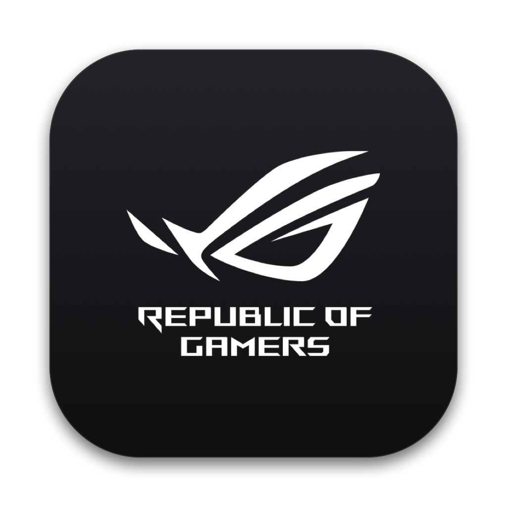

# ROG Gaming Center for macOS & Hackintosh

<p align="center">
  
</p>

<p align="center">
  <b>The Complete Native Swift Control Suite for ASUS ROG & TUF Laptops on macOS</b><br/>
  <i>Featuring macOS Tahoe Liquid Glass Aesthetics, Real-Time Hardware Telemetry, 4-Zone Aura RGB Studio, Dual-Fan Acoustic Monitoring, Performance Profiles, Sleep/Wake Auto-Repair Watchdog, and Standalone CLI Automation.</i>
</p>

<p align="center">
  
  
  
  
  
  
  
</p>

> [!IMPORTANT]
> **Active Development & Beta Notice:**
> This software is currently in **active development and is not yet production-ready**. You are warmly invited to try it out, experiment with its features, and help test. If you encounter any issues, bugs, or unexpected controller behavior, please [open an issue on GitHub](https://github.com/sritulasiram/rog-gaming-center-hackintosh/issues) with your hardware details and logs!

---

## Table of Contents

- [Overview](#overview)
- [System Architecture](#system-architecture)
- [Design System & Aesthetics](#design-system--aesthetics)
- [Key Features & Modules](#key-features--modules)
  - [1. Live Telemetry Dashboard](#1-live-telemetry-dashboard)
  - [2. 4-Zone Aura RGB Lighting Studio](#2-4-zone-aura-rgb-lighting-studio)
  - [3. Power, Cooling & Acoustic Management](#3-power-cooling--acoustic-management)
  - [4. Dedicated Hardware ROG Key Launcher (IOKit Native)](#4-dedicated-hardware-rog-key-launcher-iokit-native)
  - [5. Hackintosh Tools & IOKit Packet Stream Inspector](#5-hackintosh-tools--iokit-packet-stream-inspector)
  - [6. System Preferences & Startup Configuration](#6-system-preferences--startup-configuration)
  - [7. Liquid Glass Menu Bar Companion Popover](#7-liquid-glass-menu-bar-companion-popover)
  - [8. Sleep / Wake Auto-Repair Watchdog](#8-sleep--wake-auto-repair-watchdog)
  - [9. Standalone Native CLI (`rogauracore`)](#9-standalone-native-cli-rogauracore)
- [Supported Hardware & Compatibility](#supported-hardware--compatibility)
  - [Primary Verified Testbed](#primary-verified-testbed)
  - [Architecturally Compatible Models](#architecturally-compatible-models-ite-usb-hid-protocol)
- [Installation & Quick Start](#installation--quick-start)
- [macOS Privacy & Permissions (Input Monitoring)](#macos-privacy--permissions-input-monitoring)
- [CLI Reference Guide (`rogauracore`)](#cli-reference-guide-rogauracore)
- [Hackintosh Setup & OpenCore Tuning](#hackintosh-setup--opencore-tuning)
- [Codebase Structure](#codebase-structure)
- [Hardware & Backend Test Suite](#hardware--backend-test-suite)
- [Acknowledgements](#acknowledgements)
- [Disclaimer](#disclaimer)
- [License](#license)

---

## Overview

**ROG Gaming Center for macOS** is a 100% pure native Swift application built specifically for Hackintosh enthusiasts and ASUS ROG / TUF laptop users running macOS.

Official ASUS utility software (*Armoury Crate* and *ROG Gaming Center*) is strictly Windows-exclusive and heavily burdened with background bloatware services. This project brings a lightweight, hyper-responsive, and visually stunning macOS desktop experience with:

- **Zero External Dependencies:** No Python, no libusb, no Electron, no Node.js runtime, and no C bridging headers.
- **Direct Kernel-Level Communication:** Communicates directly with internal ASUS USB HID microcontrollers via Apple's native **IOKit HID Manager** (`IOHIDManager` / `IOHIDDeviceSetReport`).
- **Hardware Safety & Latency Control:** Enforces strict 10ms FIFO micro-delay transaction queues to guarantee proper ITE 8910 PWM register latching without bus lockup.
- **TCC Privacy Resilience:** Native detection of macOS Input Monitoring permissions (`kIOReturnNotPermitted`) with one-click deep links to System Settings.
- **macOS Tahoe "Liquid Glass" UI:** Implements modern frosted glass vibrancy, Apple Control Center-inspired bento cards, continuous squircles, and SF Symbols typography.

---

## System Architecture

```
+---------------------------------------------------------------------------------------------------+
|                                 ROG GAMING CENTER (macOS / Hackintosh)                            |
+---------------------------------------------------------------------------------------------------+
|  [APPLE SIDEBAR] |                                [MAIN CONTENT AREA]                             |
|                  |                                                                                |
|  FAVORITES       |  [Hero Header: ASUS ROG Strix GL503GE • Hardware Online]                       |
|  - Dashboard     |  - Live Dual-Fan Tachometers (RPM), CPU/GPU Thermals, 3-Way Profile Switcher   |
|  - Aura RGB      |                                                                                |
|    Studio        |  [Bento Telemetry Grid]                                                        |
|  - Power & Fans  |  - CPU Load % with 24-point rolling sparkline waveform (User / System split)   |
|  - Hackintosh    |  - Memory Allocation: Apple Activity Monitor style (App / Wired / Compressed)  |
|    Tools         |  - Battery & Power: Real-time Wattage (+AC Charging / Discharge), Health & Wear |
|  - Settings      |                                                                                |
|                  |  [Bottom HUD Modules]                                                          |
|  [ITE 8910]      |  - 4-Zone Live Backlight Glowing Map (WASD, Center-L, Center-R, Numpad)        |
|  [Re-Sync]       |  - Hardware Specifications: CPU Topology, RAM, Controller, System Uptime       |
+---------------------------------------------------------------------------------------------------+
```

### Data Flow & Communication Stack

```
+--------------------------------------------------------------------+
|  UI Layer: SwiftUI Views (MainWindowView, AuraStudio, Popover)     |
+--------------------------------------------------------------------+
                                  │
                                  ▼
+--------------------------------------------------------------------+
|  Service Layer: AuraService & TelemetryService (ObservableObjects) |
|  - State Management, Preset JSON Storage, Sleep/Wake Listeners     |
|  - IOPS Power Source Monitoring, Mach Kernel Host Statistics       |
+--------------------------------------------------------------------+
                                  │
                                  ▼
+--------------------------------------------------------------------+
|  Driver Layer: AuraDriver (IOKit HID Manager Engine)               |
|  - Device Matching (VID 0x0B05, Known PIDs, Usage Pages >= 0xFF00) |
|  - FIFO Serial Queue with 10ms Micro-Delay Register Latching       |
|  - TCC Permission State Monitoring (kIOReturnNotPermitted Check)   |
+--------------------------------------------------------------------+
                                  │
                                  ▼
+--------------------------------------------------------------------+
|  Hardware Layer: ITE 8910 / 8291 USB HID Keyboard Controller       |
|  - 17-Byte Raw Feature Reports: Handshake -> Brightness -> Payload |
+--------------------------------------------------------------------+
```

---

## Design System & Aesthetics

The interface is engineered around Apple Human Interface Guidelines and modern **macOS Tahoe "Liquid Glass"** visual aesthetics:

- **Apple-Native Sidebar:**
  - Zero dead-space geometry integrating behind macOS traffic light buttons (`.fullSizeContentView`).
  - Monochromatic SF Symbols with continuous rounded squircles (`RoundedRectangle(cornerRadius: 6, style: .continuous)`).
  - Apple `.sidebar` vibrancy material with subtle system accent tinting.
- **Liquid Glass Menu Bar Popover:**
  - Ultra-compact geometry (`290 × 320 pt`) with transient background dimming.
  - Fluid glowing circular power orb with soft emerald radial luminescence.
  - Dual-vitals bento cards displaying Fan RPM/Thermals and Battery %/Wattage.
  - Apple Control Center-style keyboard brightness capsule slider with embedded glyphs.
  - 3-Way dynamic performance profile switcher (Emerald for Silent, Sapphire for Balanced, Crimson for Turbo).
- **Interactive Visual Feedback:**
  - Live 24-point rolling CPU waveform sparkline graphs.
  - Segmented RAM pressure bar (App, Wired, Compressed, Free).
  - Interactive 4-zone keycap map with real-time RGB glow simulation.

---

## Key Features & Modules

### 1. Live Telemetry Dashboard
- **Hero Banner:** Real-time hardware identity (`ASUS ROG Strix GL503GE`), connection state indicator, CPU name, RAM capacity, dual-fan RPM, and silicon thermal readouts.
- **CPU Load & Sparkline:** Mach host statistics (`host_cpu_load_info`) providing live total usage percentage, User vs. System tick breakdown, core/thread topology, and a 24-point rolling sparkline waveform.
- **Memory Allocation Bar:** 64-bit Mach VM statistics (`vm_statistics64`) displayed in Apple Activity Monitor style (App Memory, Wired Memory, Compressed Memory, and Free Memory).
- **Battery & Power Flow:** IOKit `AppleSmartBattery` and `IOPS` integration tracking live power draw in Watts (`Voltage × Amperage`), AC adapter connection state, chemical wear percentage, full design capacity vs. raw maximum capacity, and cycle counts.
- **Backlight HUD:** Live glowing indicator orbs for all 4 keyboard zones with power toggle and one-click hardware re-sync buttons.
- **Hardware Specs HUD:** Processor brand, memory configuration, operating system build, keyboard controller descriptor, and kernel uptime.

### 2. 4-Zone Aura RGB Lighting Studio
- **Interactive Keyboard Chassis:** Vector-rendered laptop keycap visualizer with distinct zone regions:
  - **Zone 1:** WASD & Left cluster (`ESC`, `TAB`, `CAPS`, `SHIFT`, `W`, `A`, `S`, `D`, `Z`, `X`, `C`)
  - **Zone 2:** Center typing region (`4-7`, `T-U`, `F-J`, `V-M`)
  - **Zone 3:** Right navigation region (`8-DEL`, `O-]`, `K-ENT`, `, - SHIFT`)
  - **Zone 4:** Numpad, arrow keys & lightbar cluster
- **Effects & Dynamics Engine:**
  - **Single Static Color:** Solid uniform color across the whole chassis.
  - **4-Zone Custom Static:** Individual HEX colors per zone.
  - **Spectrum Color Cycle:** Hardware-native continuous rainbow cycling (Hardware Mode `0x02`).
  - **Rainbow Wave:** 4-zone rolling spectrum wave.
  - **Single & Multi Breathing:** Dual-color and 4-zone crossfade pulsing (Hardware Mode `0x01`).
  - **Strobing Flash:** Hardware strobe effect (Hardware Mode `0x0A`).
  - **Stealth Off:** Complete LED shutdown preventing default firmware maroon fallback.
- **Color Studio:**
  - Live HEX code input field with uppercase auto-formatting.
  - Scope switcher: Apply instantly to **All Zones** or target a specific zone (**WASD**, **Center-L**, **Center-R**, **Numpad**).
  - 15 curated gaming swatches (*ROG Crimson, Neon Cyan, Matrix Green, Vaporwave Pink, Ice Blue, Gold, etc.*).
  - Native macOS System Color Wheel integration (`NSColorPanel`).
- **Lighting Scenes & Preset Gallery:**
  - **12 Built-in Designer Presets:** *Spectrum Cycle, Rainbow Wave, Cyberpunk 2077, Republic of Gamers, Sunset Glow, Emerald Aurora, Toxic Matrix, Fire & Ice, Synthwave Glow, Ocean Breathing, Dragon Breath, White Lightning*.
  - **Custom Preset Studio:** Create, name, save, apply, and delete custom 4-zone lighting scenes with persistent JSON serialization.

### 3. Power, Cooling & Acoustic Management
- **Dual Fan Tachometer HUD:** Real-time RPM readout for CPU and GPU cooling fans with circular progress gauges and DTS thermal sensor monitoring.
- **Acoustic Fan Modes:**
  - **Auto (Adaptive):** Dynamic RPM curve governed by thermal load and performance profile.
  - **Overboost (Max Cooling):** Locks fans at high RPM (`5,400+ RPM`) for intense gaming or compiling.
  - **Quiet (Stealth):** Caps fan RPM (`~1,800 RPM`) for silent operation.
  - **Manual Fixed:** Granular duty-cycle slider (`20% - 100%`) with live acoustic decibel estimation (`dB`).
- **ROG Performance Profiles:**
  - **Silent (Eco Mode):** Lower thermal limits, quiet fan curve, and auto-dimmed keyboard backlight (33%) for maximum battery endurance.
  - **Balanced Mode:** Standard clock frequencies, dynamic fan curves, and balanced lighting.
  - **Turbo (ROG Gaming Mode):** Uncapped power limits (PL1/PL2), aggressive cooling curves, and 100% Aura brightness.
- **Battery Care Mode (Lithium-Ion Protection):**
  - Limit maximum AC charging threshold to **60% (Max Lifespan)**, **80% (Balanced)**, or **100% (Full Capacity)** to mitigate battery swelling and chemical wear.
- **Smart Battery Saver:**
  - Background `IOPSNotificationCreateRunLoopSource` listener that automatically dims the backlight to 33% when unplugged from AC power and seamlessly restores your preferred brightness upon reconnection.
- **GameVisual Display Profiles:**
  - Quick-switch display calibration modes: *Default Standard, Vivid Gaming, Eye Care (Warm), Cinema Rich*.

### 4. Dedicated Hardware ROG Key Launcher (IOKit Native)
- **Direct ITE 8910 Hardware Interception:** Intercepts hardware input report `0x5A` payload `0x38` (`UsagePage: 0xFF31`, `Usage: 0x0038`) emitted by the physical ROG / Armoury Crate keyboard button via Apple's native `IOHIDManager`.
- **Zero Daemon & Zero ACPI Hacks:** Requires no Karabiner-Elements, no external key daemons, and no custom DSDT/SSDT EC method re-routes.
- **Configurable One-Touch Actions:**
  - **Toggle Main Window:** Instant press-to-reveal / press-to-dismiss behavior identical to Windows Armoury Crate.
  - **Toggle Menu Bar HUD:** Opens/closes the compact Liquid Glass popover.
  - **Cycle Aura RGB Presets:** Cycles through built-in and custom lighting profiles.
  - **Toggle Backlight Power:** Instant night-mode backlight shutoff.
- **Hardware Debouncing:** Enforces 250ms hardware debounce to prevent duplicate triggers on physical key actuation.

### 5. Hackintosh Tools & IOKit Packet Stream Inspector
- **System Readiness Health Bar:** Instant visual diagnostic indicators for IOKit USB HID matching, ITE 8910 controller presence, ROG key HID listener state, sleep watchdog daemon status, and CLI binary installation.
- **One-Click Self Test:** Dispatches test transactions and validates hardware response.
- **Live 17-Byte Feature Report Inspector:**
  - Real-time visualization of the exact 17-byte raw HID report dispatched over the USB bus:
    ```
    [5D] [B3] [00] [01] [FF] [00] [33] [80] [00] [FF] [00] [FF] [FF] [00] [7F] [FF] [00]
    MAGIC CMD  ZONE MODE <--- Z1 RGB ---> <--- Z2 RGB ---> <--- Z3 RGB ---> <--- Z4 RGB ---> SPD
    ```
  - One-click **Copy Hex** button for debugging in IORegistryExplorer or Wireshark.
- **Sleep / Wake Watchdog Timeline (Console.app Style):**
  - Live chronological audit log of power events (`willSleepNotification`, `didWakeNotification`) and handshake ack timings.
- **Automation Shortcuts & Terminal Launcher:**
  - Direct execution ("Run Now" button) or external Terminal execution ("Terminal" button) for common scripting routines.

### 6. System Preferences & Startup Configuration
- **Open at Login:** Automatically installs a clean launch agent to `~/Library/LaunchAgents/com.asus.roggamingcenter.plist`.
- **Close to Tray:** Closing the main window keeps the status item, menu bar popover, and sleep watchdog active in the background.
- **Dedicated ROG Hardware Key Setup:** Enable/disable physical key listener and select default action with live hardware connection indicators.
- **Startup Defaults:** Configure your preferred default lighting preset and toggle hardware initialization handshakes on boot.
- **Global Hotkey Reference:** Quick guide for brightness adjustment and backlight toggling.

### 7. Liquid Glass Menu Bar Companion Popover
- Discreet status icon in the macOS menu bar.
- Left-click triggers the rich `290 × 320 pt` Liquid Glass Popover with live RPM, thermals, battery telemetry, brightness slider, profile switcher, and preset chips.
- Right-click or Control-click reveals a fast native context menu with brightness levels, preset submenus, hardware re-sync, and quit actions.

### 8. Sleep / Wake Auto-Repair Watchdog
- **The Issue:** ASUS ITE 8910 / 8291 USB HID controllers lose volatile register state when resuming from macOS system sleep (entering an unlit or default maroon state).
- **The Fix:** An automatic background observer monitors `NSWorkspace.didWakeNotification`, `screensDidWakeNotification`, and `sessionDidBecomeActiveNotification`. After a 600ms debounce, it re-transmits the `"ASUS Tech.Inc."` handshake and reapplies the user's active lighting profile with zero manual intervention.

### 9. Standalone Native CLI (`rogauracore`)
- Bundled pure Swift command-line tool with zero external runtime dependencies.
- Perfect for shell scripts, Terminal aliases, keyboard shortcut daemons (skhd), Alfred workflows, Raycast script commands, and Elgato Stream Deck integrations.

---

## Supported Hardware & Compatibility

### Primary Verified Testbed
- **Model:** ASUS ROG Strix GL503GE
- **Controller:** ITE 8910 USB HID Controller (`VID: 0x0B05`, `PID: 0x1869`)
- **Lighting:** 4-Zone RGB Backlight
- **Status:** **Fully Tested & 100% Verified** across all IOKit HID features, 4-zone lighting studio, dual-fan telemetry, battery care thresholds, and sleep/wake auto-repair watchdog.

### Architecturally Compatible Models (ITE USB HID Protocol)
The following models utilize the same ASUS ITE USB HID microcontroller protocol (`0x5A` handshake, `0x5D 0xB3` packet structure, `0x5D 0xB5` set, `0x5D 0xB4` apply) according to open-source reverse-engineering specifications (`rogauracore` / Linux kernel `asus-wmi` / `AsusSMC`). If you own one of these models, the application is designed to communicate with your controller out-of-the-box:

| Series | Models | Controller / Protocol Status |
| :--- | :--- | :--- |
| **ROG Strix (15" & 17")** | GL503GE | **Verified Working (Primary Testbed)** |
| **ROG Strix (15" & 17")** | GL503VD, GL503VS, GL503VM, GL703, GL703GE, GL703GS, GL703VD | Compatible (ITE 8910 / 8291 Protocol) |
| **ROG Strix SCAR & Hero** | GL504, GL504GM, GL504GS (SCAR II / Hero II), GL553, GL553VD, GL553VE, GL753 | Compatible (ITE 8910 / 8291 Protocol) |
| **ROG Zephyrus** | GX501, GM501, GA503, G531, G533, G733 | Compatible (Aura Core Protocol) |
| **TUF Gaming** | FX504, FX505, FX705 (RGB models) | Compatible (ITE USB HID 1-Zone / 4-Zone) |


---

## Installation & Quick Start

### 1-Click Build & Install to `/Applications`

Clone the repository and run the build script with the `--install` flag:

```bash
git clone https://github.com/sritulasiram/rog-gaming-center-hackintosh.git
cd rog-gaming-center-hackintosh
./build.sh --install
```

This automated script will:
1. Compile the native Swift application (`ROG Gaming Center.app`).
2. Compile the standalone CLI utility (`rogauracore`).
3. Package the app bundle with high-resolution icons and Info.plist.
4. Apply consistent ad-hoc or developer code-signing.
5. Install the app to `/Applications/ROG Gaming Center.app`.
6. Install the CLI binary to `/usr/local/bin/rogauracore` (if writable).
7. Reset stale TCC cache entries (`tccutil reset ListenEvent com.asus.roggamingcenter`) to prompt for Input Monitoring permissions.
8. Launch the application.

### Manual Build

```bash
./build.sh
```

**Build Artifacts:**
- Application Bundle: `./build/ROG Gaming Center.app`
- Standalone CLI: `./build/rogauracore`

### Custom Code-Signing (Survives Rebuilds)

To prevent macOS from resetting your Input Monitoring permission after every rebuild, sign with your local Apple Development certificate:

```bash
SIGNING_IDENTITY="Apple Development: your_email@example.com (XXXXXXXXXX)" ./build.sh --install
```

---

## macOS Privacy & Permissions (Input Monitoring)

Because the keyboard backlight controller is an internal USB HID device that shares an interface with the physical keyboard, macOS treats vendor feature report writes as sensitive input events.

### How to Grant Permission:

1. Open **System Settings** → **Privacy & Security** → **Input Monitoring**.
2. Enable the toggle for **ROG Gaming Center**.
3. If prompted, select **Quit & Reopen**.

```
+-----------------------------------------------------------------------+
|  System Settings > Privacy & Security > Input Monitoring              |
|                                                                       |
|  [ ✓ ] ROG Gaming Center                                              |
|                                                                       |
|  Allows ROG Gaming Center to send USB HID feature reports to the      |
|  internal ITE keyboard backlight controller.                          |
+-----------------------------------------------------------------------+
```

### In-App Detection & Deep Link

If macOS blocks HID writes, the app detects `kIOReturnNotPermitted` immediately and displays a prominent status banner in the sidebar with a direct button: **"Grant Input Monitoring Access"**, which opens System Settings straight to the Input Monitoring pane.

---

## CLI Reference Guide (`rogauracore`)

The bundled standalone CLI utility (`rogauracore`) provides complete terminal control:

### Command Overview

| Command | Arguments | Description | Example |
| :--- | :--- | :--- | :--- |
| `--status`, `-s` | *None* | Displays detected USB HID hardware telemetry | `rogauracore --status` |
| `--json` | *None* | Outputs device topology and info in JSON format | `rogauracore --json` |
| `resync`, `-r` | *None* | Forces hardware handshake and restores state | `rogauracore resync` |
| `init`, `initialize_keyboard` | *None* | Wakes and initializes the controller | `rogauracore init` |
| `brightness` | `<0-3>` | Sets backlight brightness (0=Off, 1=33%, 2=66%, 3=100%) | `rogauracore brightness 3` |
| `on` | *None* | Turns on backlight (White, 100% brightness) | `rogauracore on` |
| `off` | *None* | Turns off backlight completely | `rogauracore off` |
| `single_static` | `<HEX>` | Sets a single solid color for all keys | `rogauracore single_static 00f0ff` |
| `multi_static` | `<Z1> <Z2> <Z3> <Z4>` | Sets 4 distinct zone colors (WASD, Mid, Right, Num) | `rogauracore multi_static ff007f 8000ff 00ffff 007fff` |
| `single_breathing` | `<HEX1> <HEX2> [SPD 1-3]` | Breathing animation between 2 colors | `rogauracore single_breathing 00ffff 0000ff 2` |
| `multi_breathing` | `<Z1> <Z2> <Z3> <Z4> [SPD]` | 4-zone simultaneous breathing effect | `rogauracore multi_breathing ff0000 00ff00 0000ff ffff00 2` |
| `single_colorcycle` | `[SPD 1-3]` | Spectrum rainbow color cycle | `rogauracore single_colorcycle 2` |
| `rainbow` | `[SPD 1-3]` | 4-Zone rainbow wave effect | `rogauracore rainbow 2` |
| `single_strobing` | `<HEX> [SPD 1-3]` | Fast strobing / flashing effect | `rogauracore single_strobing ffffff 3` |
| `presets` | *None* | Lists all available designer presets | `rogauracore presets` |
| `preset` | `<name>` | Applies a preset by name or keyword | `rogauracore preset cyberpunk` |
| `<color_name>` | *None* | Shortcut for standard colors (`red`, `cyan`, `gold`, etc.) | `rogauracore cyan` |

### Scripting Examples

```bash
# Set a Cyberpunk neon aesthetic
rogauracore preset cyberpunk

# Set solid ROG Crimson at maximum brightness
rogauracore single_static ff0033
rogauracore brightness 3

# Dim keyboard for nighttime coding
rogauracore brightness 1

# Extract JSON status in a shell script
CONNECTED=$(rogauracore --json | grep '"connected"' | awk '{print $2}')
```

---

## Hackintosh Setup & OpenCore Tuning

1. **USB Port Mapping (Crucial):**
   - Ensure the internal USB keyboard controller (usually located on `HS07` or `HS05`, Vendor ID `0x0B05`) is declared as **Internal (`Type 255`)** in your OpenCore `USBMap.kext` or `UTBMap.kext`. Marking it as an external USB port will cause controller disconnections during sleep transitions.
2. **Kext Compatibility:**
   - Works harmoniously alongside `VirtualSMC.kext` and `AsusSMC.kext` (which manages Fn hotkeys and ACPI battery threshold calls `BCLM` / `CBAT`).
3. **Sleep Watchdog Optimization:**
   - ROG Gaming Center operates completely in user space without requiring root daemons or custom sleep/wake shell scripts in `/usr/local/bin`.

---

## Codebase Structure

```
rog-gaming-center/
├── LICENSE                        # MIT License
├── README.md                      # Comprehensive Documentation
├── ROGGamingCenter.entitlements   # macOS Code-Signing Entitlements (Un-sandboxed)
├── build.sh                       # Automated Compiler, Packager & Installer
├── Resources/
│   ├── AppIcon.icns               # macOS High-Resolution Application Icon
│   ├── app_icon.png               # PNG App Icon for UI & Documentation
│   ├── logo.png                   # ROG Fearless Eye Logo
│   ├── menubar_icon.png           # 1x Menu Bar Status Icon (Template)
│   ├── menubar_icon@2x.png        # 2x Retina Menu Bar Status Icon (Template)
│   ├── rog_emblem_red.svg         # Vector ROG Red Emblem
│   └── rog_emblem_white.svg       # Vector ROG White Emblem
├── Sources/
│   ├── main.swift                 # App Lifecycle, NSStatusItem & Menu Bar Setup
│   ├── AuraProtocol.swift         # 17-Byte Packet Builder, RGB Models, Modes & Presets
│   ├── AuraDriver.swift           # Native IOKit HID Manager, Device Matching & Micro-Delays
│   ├── AuraService.swift          # Core Service: State Management, Presets, Sleep Watchdog
│   ├── TelemetryService.swift     # Telemetry Engine: CPU Load, Memory, Battery & Fan RPM
│   ├── AuraCLI.swift              # Standalone 'rogauracore' CLI Binary Entry Point
│   ├── AuraPopoverView.swift      # Liquid Glass Menu Bar Companion Popover View
│   └── Views/
│       ├── MainWindowView.swift   # Main App Window, Apple Sidebar & Tab Router
│       ├── DashboardView.swift    # Bento Telemetry Grid, Sparkline & Hardware Specs
│       ├── AuraStudioView.swift   # 4-Zone Keycap Chassis Visualizer, Color Studio & Presets
│       ├── PowerFanView.swift     # Dual Fan Tachometer HUD, Performance Profiles, Battery Care
│       ├── HackintoshToolsView.swift # IOKit Packet Inspector, Console Timeline & CLI Launcher
│       ├── SettingsView.swift     # Launch at Login, Defaults & Hotkeys
│       └── ROGLogoView.swift      # Vector ROG Fearless Eye Shape & Image Loader
└── Tests/
    └── test_backend.swift         # Hardware & IOKit HID Validation Suite
```

---

## Hardware & Backend Test Suite

To run the automated backend test suite directly against your laptop's internal USB HID controller:

```bash
swift -framework IOKit -framework Foundation ./Tests/test_backend.swift
```

### Verified Test Points:
- `[Test Point 1]` IOKit HID Discovery, Vendor Matching & Usage Page Identification
- `[Test Point 2]` Controller Handshake (`"ASUS Tech.Inc."`) & Brightness Register Verification
- `[Test Point 3]` RGB Color Payload Dispatch & Hardware SET/APPLY Latch Commits
- `[Test Point 4]` Dynamic Hardware Animation Mode Dispatch (Spectrum Cycle `0x02`)
- `[Test Point 5]` Host Kernel Telemetry Extraction (`sysctl`, `mach_host_self`)

---

## Acknowledgements

- **[wrobelda / wroberts](https://github.com/wroberts/rogauracore)** — Reverse-engineering of the ASUS ROG Aura ITE USB protocol and creation of the original Linux `rogauracore` utility.
- **[black-dragon74](https://github.com/black-dragon74/macRogAuraCore)** — Early macOS IOKit HID experiments and USB protocol exploration.
- **[hieplpvip](https://github.com/hieplpvip/AsusSMC)** — Creator of `AsusSMC.kext` and pioneer of ASUS laptop hardware control on macOS.
- **[Acidanthera](https://github.com/acidanthera)** — OpenCore, Lilu, VirtualSMC, and the foundation of the modern Hackintosh ecosystem.
- **[Seerge / G-Helper](https://github.com/seerge/g-helper)** & **[asusctl](https://gitlab.com/asus-linux/asusctl)** — Inspiration for clean, lightweight, all-in-one ASUS hardware control without background bloatware.
- **ASUS (Republic of Gamers)** — Engineering of the ROG and TUF laptop hardware.

---

## Disclaimer

- **Educational & Research Purposes Only:** This software and project is developed strictly for **educational, academic, and non-commercial hardware interoperability research purposes**.
- **Copyright & Trademark Non-Infringement:** This project does not intend to infringe upon, claim ownership of, or challenge any copyrights, intellectual property, patents, or trademarks owned by **ASUSTeK Computer Inc. (ASUS)**, **Apple Inc.**, or any of their respective subsidiaries or affiliates.
- **Non-Affiliation:** This project is an independent open-source community research tool and is **not affiliated with, maintained, authorized, endorsed, or sponsored by ASUSTeK Computer Inc. (ASUS) or Apple Inc.**
- **Trademarks:** All product names, logos, brands, emblems, and registered trademarks (including *ASUS*, *ROG*, *Republic of Gamers*, *Aura*, *Armoury Crate*, *Apple*, *macOS*, and *MacBook*) are the exclusive property of their respective owners. Any use of these names or marks within this repository is purely for identification, descriptive, and nominative interoperability purposes.
- **"AS IS" Hardware & Software Use:** This software interacts directly with internal USB HID microcontroller hardware and system statistics. While thoroughly tested with micro-delay safety FIFO queues, this software is provided **"AS IS" WITHOUT WARRANTY OF ANY KIND**, express or implied. The authors and contributors assume no liability for any issues, hardware behaviors, or data loss arising from its use.

---

## License

This project is licensed under the **MIT License** — see the [LICENSE](LICENSE) file for details.
